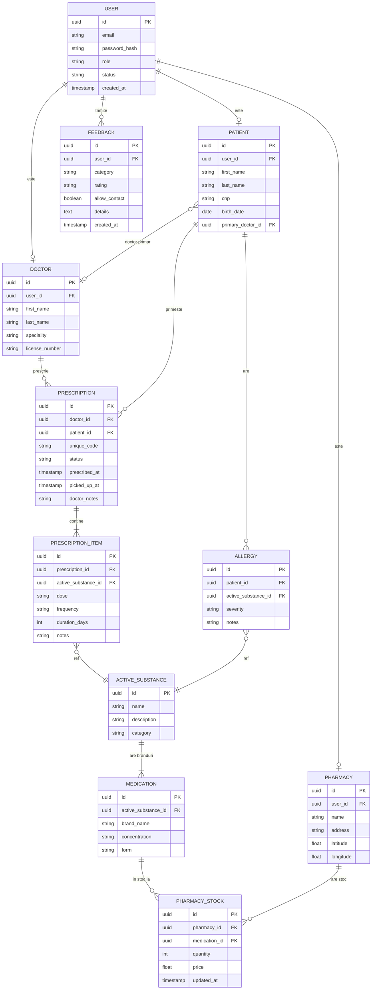

# Model de Date — MedConnect

## Diagrama ERD

---

## Descrierea tabelelor

### `USER`
Tabelul central de autentificare. Orice persoană din sistem — doctor, pacient, farmacie sau admin — are un rând aici. Nu stochează date de profil, ci doar credențialele și rolul.

| Câmp | Tip | Descriere |
|---|---|---|
| `id` | UUID | Cheie primară |
| `email` | string | Email unic, folosit la login |
| `password_hash` | string | Parola stocată hashuit (bcrypt) |
| `role` | enum | `ADMIN`, `DOCTOR`, `PATIENT`, `PHARMACY` |
| `status` | enum | `PENDING`, `ACTIVE`, `REJECTED` — doctoriii și farmaciile încep cu `PENDING` |
| `created_at` | timestamp | Data înregistrării |

**Relații:**
- `1:1` cu `DOCTOR` — un user de tip doctor are exact un profil de doctor
- `1:1` cu `PATIENT` — un user de tip pacient are exact un profil de pacient
- `1:1` cu `PHARMACY` — un user de tip farmacie are exact un profil de farmacie
- `1:N` cu `FEEDBACK` — un user poate trimite oricâte feedbackuri

---

### `DOCTOR`
Profilul profesional al doctorului. Conține datele de identificare și specialitatea, care va fi folosită pentru a restricționa prescrierea medicamentelor în afara ariei de expertiză.

| Câmp | Tip | Descriere |
|---|---|---|
| `id` | UUID | Cheie primară |
| `user_id` | UUID FK | Referință către `USER` |
| `first_name` | string | Prenume |
| `last_name` | string | Nume de familie |
| `speciality` | string | Specialitatea medicală (ex: Cardiologie, Pediatrie) |
| `license_number` | string | Numărul licenței medicale |

**Relații:**
- `1:1` cu `USER` — fiecare doctor are exact un cont de autentificare
- `1:N` cu `PRESCRIPTION` — un doctor poate prescrie oricâte rețete
- `1:N` cu `PATIENT` (opțional) — un doctor poate fi doctor primar pentru mai mulți pacienți

---

### `PATIENT`
Profilul pacientului. Conține datele personale și referința către doctorul primar. Datele medicale (alergii, rețete) stau în tabelele dedicate, legate prin `patient_id`.

| Câmp | Tip | Descriere |
|---|---|---|
| `id` | UUID | Cheie primară |
| `user_id` | UUID FK | Referință către `USER` |
| `first_name` | string | Prenume |
| `last_name` | string | Nume de familie |
| `cnp` | string | CNP unic — folosit de farmacie pentru identificare |
| `birth_date` | date | Data nașterii |
| `primary_doctor_id` | UUID FK | Referință către `DOCTOR` (doctorul de familie) |

**Relații:**
- `1:1` cu `USER` — fiecare pacient are exact un cont de autentificare
- `N:1` cu `DOCTOR` — un pacient are un singur doctor primar, dar un doctor poate fi primar pentru mulți pacienți
- `1:N` cu `PRESCRIPTION` — un pacient poate avea oricâte rețete prescrise
- `1:N` cu `ALLERGY` — un pacient poate avea oricâte alergii înregistrate

---

### `PHARMACY`
Profilul farmaciei. Conține datele de contact și coordonatele geografice, folosite pentru a calcula proximitatea față de pacient.

| Câmp | Tip | Descriere |
|---|---|---|
| `id` | UUID | Cheie primară |
| `user_id` | UUID FK | Referință către `USER` |
| `name` | string | Numele farmaciei |
| `address` | string | Adresa completă |
| `latitude` | float | Latitudine (pentru filtrare geografică) |
| `longitude` | float | Longitudine (pentru filtrare geografică) |

**Relații:**
- `1:1` cu `USER` — fiecare farmacie are exact un cont de autentificare
- `1:N` cu `PHARMACY_STOCK` — o farmacie are oricâte intrări de stoc

---

### `ACTIVE_SUBSTANCE`
Substanța activă farmacologică (ex: Ibuprofen, Amoxicilină). Aceasta este unitatea fundamentală a sistemului — alergiile și rețetele operează la acest nivel, nu la nivelul brandului comercial. Modulul AI verifică interacțiunile tot pe baza substanței active.

| Câmp | Tip | Descriere |
|---|---|---|
| `id` | UUID | Cheie primară |
| `name` | string | Denumirea substanței (ex: Ibuprofen) |
| `description` | string | Descriere generală |
| `category` | string | Categoria farmacologică (ex: AINS, Antibiotic) |

**Relații:**
- `1:N` cu `MEDICATION` — o substanță activă poate apărea în mai multe branduri comerciale
- `1:N` cu `ALLERGY` — o substanță activă poate fi sursa alergiei unui pacient
- `1:N` cu `PRESCRIPTION_ITEM` — doctorul prescrie substanța activă, nu brandul

---

### `MEDICATION`
Produsul comercial (brandul) care conține o substanță activă. Farmacia gestionează stocul la nivel de medicament (brand + concentrație + formă), nu la nivel de substanță activă.

| Câmp | Tip | Descriere |
|---|---|---|
| `id` | UUID | Cheie primară |
| `active_substance_id` | UUID FK | Referință către `ACTIVE_SUBSTANCE` |
| `brand_name` | string | Numele comercial (ex: Nurofen, Ibuprofen Teva) |
| `concentration` | string | Concentrația (ex: 400mg, 200mg) |
| `form` | string | Forma farmaceutică (ex: comprimat, sirop, injecție) |

**Relații:**
- `N:1` cu `ACTIVE_SUBSTANCE` — mai multe branduri pot conține aceeași substanță activă
- `1:N` cu `PHARMACY_STOCK` — același medicament poate fi în stocul mai multor farmacii

---

### `ALLERGY`
Înregistrează alergiile unui pacient la o substanță activă. Acest tabel este verificat automat de sistem (și de modulul AI) la prescrierea unei rețete.

| Câmp | Tip | Descriere |
|---|---|---|
| `id` | UUID | Cheie primară |
| `patient_id` | UUID FK | Referință către `PATIENT` |
| `active_substance_id` | UUID FK | Referință către `ACTIVE_SUBSTANCE` |
| `severity` | enum | `MILD`, `MODERATE`, `SEVERE` |
| `notes` | string | Observații suplimentare (ex: tip de reacție) |

**Relații:**
- `N:1` cu `PATIENT` — un pacient poate avea mai multe alergii; o alergie aparține unui singur pacient
- `N:1` cu `ACTIVE_SUBSTANCE` — mai mulți pacienți pot fi alergici la aceeași substanță

> Relația `PATIENT ↔ ACTIVE_SUBSTANCE` prin `ALLERGY` este practic o relație **M:N** cu atribute suplimentare (severitate, note).

---

### `PRESCRIPTION`
Antetul rețetei medicale. Conține metadatele rețetei: cine a prescris, pentru cine, când, și statusul curent. Medicamentele efective sunt în `PRESCRIPTION_ITEM`.

| Câmp | Tip | Descriere |
|---|---|---|
| `id` | UUID | Cheie primară |
| `doctor_id` | UUID FK | Referință către `DOCTOR` |
| `patient_id` | UUID FK | Referință către `PATIENT` |
| `unique_code` | string | Cod unic de ridicare, generat automat (ex: UUID scurt sau alfanumeric) |
| `status` | enum | `PRESCRIBED`, `PICKED_UP`, `EXPIRED` |
| `prescribed_at` | timestamp | Data și ora prescrierii |
| `picked_up_at` | timestamp | Data și ora ridicării (null dacă nu a fost ridicată) |
| `doctor_notes` | string | Observații generale ale doctorului |

**Relații:**
- `N:1` cu `DOCTOR` — mai multe rețete pot fi prescrise de același doctor
- `N:1` cu `PATIENT` — mai multe rețete pot aparține aceluiași pacient
- `1:N` cu `PRESCRIPTION_ITEM` — o rețetă conține unul sau mai multe medicamente prescrise

---

### `PRESCRIPTION_ITEM`
Liniile rețetei — câte un rând per substanță activă prescrisă. Nu este un simplu tabel de join, ci are atribute proprii (doză, frecvență, durată).

| Câmp | Tip | Descriere |
|---|---|---|
| `id` | UUID | Cheie primară |
| `prescription_id` | UUID FK | Referință către `PRESCRIPTION` |
| `active_substance_id` | UUID FK | Referință către `ACTIVE_SUBSTANCE` |
| `dose` | string | Doza prescrisă (ex: 400mg) |
| `frequency` | string | Frecvența administrării (ex: de 3 ori pe zi) |
| `duration_days` | int | Durata tratamentului în zile |
| `notes` | string | Observații specifice (ex: se ia după masă) |

**Relații:**
- `N:1` cu `PRESCRIPTION` — mai multe linii aparțin aceleiași rețete
- `N:1` cu `ACTIVE_SUBSTANCE` — mai multe linii pot referi aceeași substanță activă (în rețete diferite)

> Relația `PRESCRIPTION ↔ ACTIVE_SUBSTANCE` prin `PRESCRIPTION_ITEM` este o relație **M:N cu atribute** — tocmai de aceea avem tabelul separat și nu un simplu tabel de join.

---

### `PHARMACY_STOCK`
Stocul farmaciei — câte un rând per medicament (brand) per farmacie. Pacientul vede acest tabel filtrat după proximitate și după medicamentele din rețeta sa activă.

| Câmp | Tip | Descriere |
|---|---|---|
| `id` | UUID | Cheie primară |
| `pharmacy_id` | UUID FK | Referință către `PHARMACY` |
| `medication_id` | UUID FK | Referință către `MEDICATION` |
| `quantity` | int | Cantitatea disponibilă în stoc |
| `price` | float | Prețul per unitate |
| `updated_at` | timestamp | Ultima actualizare a stocului |

**Relații:**
- `N:1` cu `PHARMACY` — mai multe intrări de stoc aparțin aceleiași farmacii
- `N:1` cu `MEDICATION` — același medicament poate fi în stocul mai multor farmacii

> Relația `PHARMACY ↔ MEDICATION` prin `PHARMACY_STOCK` este o relație **M:N cu atribute** (cantitate, preț, dată actualizare).

---

### `FEEDBACK`
Feedback-ul trimis de utilizatori. Accesibil tuturor rolurilor autentificate, vizibil doar pentru admin.

| Câmp | Tip | Descriere |
|---|---|---|
| `id` | UUID | Cheie primară |
| `user_id` | UUID FK | Referință către `USER` — cine a trimis |
| `category` | enum | `BUG`, `SUGGESTION`, `OTHER` |
| `rating` | enum | `POSITIVE`, `NEUTRAL`, `NEGATIVE` |
| `allow_contact` | boolean | Acordul utilizatorului de a fi contactat |
| `details` | text | Textul liber al feedback-ului |
| `created_at` | timestamp | Data trimiterii |

**Relații:**
- `N:1` cu `USER` — un user poate trimite oricâte feedbackuri; un feedback aparține unui singur user

---

## Rezumat relații

| Relație | Tip | Explicație |
|---|---|---|
| `USER` → `DOCTOR` | 1:1 | Un cont = un profil de doctor |
| `USER` → `PATIENT` | 1:1 | Un cont = un profil de pacient |
| `USER` → `PHARMACY` | 1:1 | Un cont = un profil de farmacie |
| `USER` → `FEEDBACK` | 1:N | Un user poate trimite mai multe feedbackuri |
| `DOCTOR` → `PRESCRIPTION` | 1:N | Un doctor prescrie multe rețete |
| `PATIENT` → `PRESCRIPTION` | 1:N | Un pacient primește multe rețete |
| `PATIENT` → `DOCTOR` (primar) | N:1 | Mulți pacienți au același doctor primar |
| `PATIENT` → `ALLERGY` | 1:N | Un pacient are mai multe alergii |
| `PRESCRIPTION` → `PRESCRIPTION_ITEM` | 1:N | O rețetă are mai multe linii |
| `ACTIVE_SUBSTANCE` → `MEDICATION` | 1:N | O substanță = mai multe branduri |
| `ACTIVE_SUBSTANCE` → `PRESCRIPTION_ITEM` | 1:N | O substanță apare în mai multe linii de rețetă |
| `ACTIVE_SUBSTANCE` → `ALLERGY` | 1:N | O substanță poate alergiza mai mulți pacienți |
| `PHARMACY` → `PHARMACY_STOCK` | 1:N | O farmacie are mai multe intrări de stoc |
| `MEDICATION` → `PHARMACY_STOCK` | 1:N | Un medicament e în stocul mai multor farmacii |